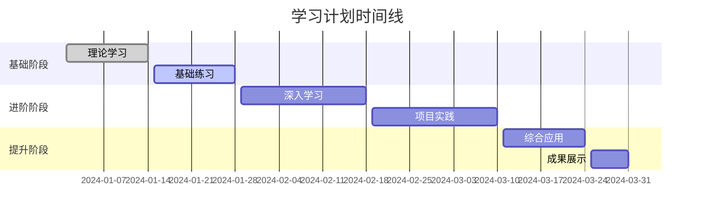
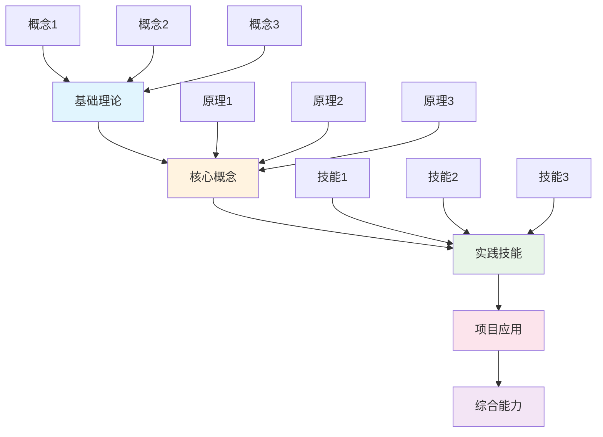

# 📅 {{title}}

> [!info] 📋 计划信息
> **创建时间**: {{date:YYYY-MM-DD HH:mm}}
> **计划类型**: 📚 学习计划 / 📊 复习计划 / 🎯 专项训练
> **时间范围**: 
> **优先级**: `#高优先级` / `#中优先级` / `#低优先级`
> **计划状态**: `#制定中` / `#执行中` / `#已完成` / `#已暂停`

## 🎯 计划目标

```mermaid
mindmap
  root(({{title}}))
    学习目标
      知识目标
      技能目标
      能力目标
    时间安排
      每日计划
      每周计划
      阶段计划
    成果验收
      理论掌握
      实践能力
      项目成果
    资源配置
      学习资料
      实践环境
      辅导支持
```

> [!goal] 🏆 核心目标
> 明确这个学习计划要达成的核心目标，确保学习方向正确。

### 🎯 总体目标
- [ ] **主要目标1**: 具体、可衡量的学习目标
- [ ] **主要目标2**: 具体、可衡量的学习目标
- [ ] **主要目标3**: 具体、可衡量的学习目标

### 📊 量化指标

| 指标类型 | 目标值 | 当前值 | 完成度 | 截止时间 |
|----------|--------|--------|--------|----------|
| 知识点掌握 | 100% | 0% | 🔴 0% | 2024-XX-XX |
| 实践项目 | 3个 | 0个 | 🔴 0% | 2024-XX-XX |
| 技能等级 | 高级 | 初级 | 🔴 0% | 2024-XX-XX |

## ⏰ 时间安排



### 📅 每日学习安排

> [!schedule] ⏰ 时间分配策略

**工作日安排** (周一至周五):
- **早晨 (7:00-8:00)**: 理论复习 📚
- **上午 (9:00-12:00)**: 核心学习时间 🎯
- **下午 (14:00-17:00)**: 实践练习 💻
- **晚上 (19:00-21:00)**: 总结整理 📝

**周末安排** (周六、周日):
- **上午 (9:00-12:00)**: 项目实战 🚀
- **下午 (14:00-17:00)**: 深度学习 🔍
- **晚上 (19:00-21:00)**: 复习巩固 🔄

### 📊 每周学习计划

#### 第1周：基础建立期

> [!week] 📚 本周目标
> 建立扎实的理论基础，熟悉基本概念和工具使用。

**学习重点**:
- [ ] **理论学习** (40%)
  - [ ] [[基础概念1]] - 2小时/天
  - [ ] [[基础概念2]] - 2小时/天
  - [ ] [[基础概念3]] - 1小时/天

- [ ] **实践练习** (40%)
  - [ ] 基础练习题 - 1小时/天
  - [ ] 工具使用练习 - 1小时/天

- [ ] **总结复习** (20%)
  - [ ] 每日总结 - 30分钟/天
  - [ ] 周末复习 - 2小时

**本周交付物**:
- [ ] 基础概念思维导图
- [ ] 练习题完成记录
- [ ] 学习心得总结

#### 第2周：技能提升期

> [!week] 💪 本周目标
> 深入理解核心原理，提升实际操作技能。

**学习重点**:
- [ ] **深度学习** (50%)
  - [ ] [[进阶概念1]] - 2.5小时/天
  - [ ] [[进阶概念2]] - 2.5小时/天

- [ ] **技能训练** (30%)
  - [ ] 专项技能练习 - 1.5小时/天

- [ ] **项目准备** (20%)
  - [ ] 项目规划 - 1小时/天

**本周交付物**:
- [ ] 进阶知识总结
- [ ] 技能练习成果
- [ ] 项目计划书

#### 第3-4周：实战应用期

> [!week] 🚀 本周目标
> 通过实际项目应用所学知识，提升综合能力。

**学习重点**:
- [ ] **项目实战** (60%)
  - [ ] 项目开发 - 3小时/天

- [ ] **问题解决** (25%)
  - [ ] 难点攻克 - 1.25小时/天

- [ ] **知识巩固** (15%)
  - [ ] 相关知识复习 - 45分钟/天

**本周交付物**:
- [ ] 完整项目成果
- [ ] 技术文档
- [ ] 经验总结报告

## 📚 学习内容规划

### 🎯 核心知识模块



#### 📖 模块一：[[基础理论]]
**学习目标**: 掌握基础理论知识
**时间安排**: 第1周
**学习方式**: 理论学习 + 概念练习

- [ ] **知识点1**: [[具体知识点]] - 预计2天
- [ ] **知识点2**: [[具体知识点]] - 预计2天
- [ ] **知识点3**: [[具体知识点]] - 预计3天

#### 💻 模块二：[[实践技能]]
**学习目标**: 提升实际操作能力
**时间安排**: 第2周
**学习方式**: 动手实践 + 项目练习

- [ ] **技能1**: [[具体技能]] - 预计2天
- [ ] **技能2**: [[具体技能]] - 预计3天
- [ ] **技能3**: [[具体技能]] - 预计2天

#### 🚀 模块三：[[项目应用]]
**学习目标**: 综合应用所学知识
**时间安排**: 第3-4周
**学习方式**: 项目实战 + 问题解决

- [ ] **项目1**: [[项目名称]] - 预计1周
- [ ] **项目2**: [[项目名称]] - 预计1周

## 📊 进度跟踪

> [!progress] 📈 学习进度监控

### 📅 每日进度记录

| 日期 | 计划任务 | 实际完成 | 学习时长 | 完成度 | 备注 |
|------|----------|----------|----------|--------|------|
| 2024-01-01 | 基础概念学习 | - | 0h | 0% | - |
| 2024-01-02 | 实践练习 | - | 0h | 0% | - |

### 📊 周度总结

#### 第1周总结 (2024-01-01 ~ 2024-01-07)

> [!summary] 📋 本周回顾

**完成情况**:
- ✅ 已完成任务列表
- 🔄 进行中任务列表
- ❌ 未完成任务列表

**学习收获**:
- 收获1: 具体描述
- 收获2: 具体描述

**遇到问题**:
- 问题1: 问题描述及解决方案
- 问题2: 问题描述及解决方案

**下周计划调整**:
- 调整1: 具体调整内容
- 调整2: 具体调整内容

### 📈 整体进度

<div class="progress-bar">
  <div class="progress-fill" style="width: 0%" data-progress="0%"></div>
</div>

**当前进度**: 0%
**预计完成时间**: 2024-XX-XX
**实际完成时间**: 待定

## 🎯 成果验收

> [!check] ✅ 验收标准

### 📋 阶段性验收

#### 第1阶段验收 (基础理论)
- [ ] **理论掌握**: 能够清楚解释核心概念
- [ ] **概念应用**: 能够运用概念解决基础问题
- [ ] **知识关联**: 理解概念间的关联关系

#### 第2阶段验收 (实践技能)
- [ ] **技能操作**: 熟练掌握基本操作技能
- [ ] **问题解决**: 能够独立解决常见问题
- [ ] **工具使用**: 熟练使用相关工具软件

#### 第3阶段验收 (项目应用)
- [ ] **项目完成**: 成功完成预定项目
- [ ] **质量标准**: 项目达到预期质量要求
- [ ] **创新应用**: 能够创新性地应用所学知识

### 🏆 最终验收标准

> [!success] 🎉 学习完成标志
> 当达到以下标准时，可以认为学习计划成功完成：

- [ ] **知识掌握**: 90%以上知识点达到掌握标准
- [ ] **技能应用**: 能够独立完成相关技能操作
- [ ] **项目成果**: 完成所有预定项目并达到质量要求
- [ ] **综合能力**: 具备解决实际问题的综合能力
- [ ] **持续学习**: 建立了持续学习的能力和习惯

## 📚 学习资源

> [!resources] 📖 资源配置

### 📖 学习材料
- [[教材1]] - 主要教材
- [[教材2]] - 参考教材
- [[在线课程]] - 视频教程
- [[文档资料]] - 技术文档

### 💻 实践环境
- **硬件要求**: 具体硬件配置要求
- **软件环境**: 需要安装的软件列表
- **在线平台**: 使用的在线学习平台

### 👥 支持资源
- **导师指导**: 导师联系方式和指导时间
- **学习小组**: 学习小组成员和交流方式
- **在线社区**: 相关技术社区和论坛

## 🔄 风险管理

> [!warning] ⚠️ 风险识别与应对

### 📋 潜在风险

| 风险类型 | 风险描述 | 影响程度 | 应对策略 |
|----------|----------|----------|----------|
| 时间风险 | 学习时间不足 | 高 | 调整计划，提高效率 |
| 难度风险 | 内容过于困难 | 中 | 寻求帮助，分解难点 |
| 动力风险 | 学习动力不足 | 中 | 设置激励，调整目标 |
| 资源风险 | 学习资源不足 | 低 | 寻找替代资源 |

### 🛠️ 应对措施
- **时间管理**: 制定详细的时间计划，使用时间管理工具
- **难点攻克**: 建立问题解决机制，及时寻求帮助
- **动力维持**: 设置阶段性奖励，定期回顾成果
- **资源保障**: 提前准备备用资源，建立资源获取渠道

## 🏷️ 标签

`#学习计划` `#时间管理` `#目标管理` `#进度跟踪`

---

> [!tip] 💡 学习建议
> - 保持规律的学习节奏
> - 及时记录学习心得
> - 定期回顾和调整计划
> - 注重理论与实践结合
> - 建立良好的学习习惯

**📊 最后更新**: {{date:YYYY-MM-DD HH:mm}}
**🔗 相关计划**: [[]] | [[]] | [[]]
