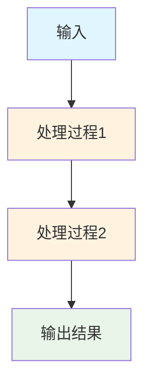
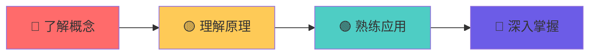

# {{title}}

> [!info] 📚 知识点信息
> **创建时间**: {{date:YYYY-MM-DD HH:mm}}
> **学科领域**: 
> **难度等级**: `#基础` / `#进阶` / `#高级` / `#专家`
> **学习状态**: `#待学习` / `#学习中` / `#已掌握` / `#需复习`

## 🎯 学习目标

```mermaid
mindmap
  root(({{title}}))
    目标1
      子目标1.1
      子目标1.2
    目标2
      子目标2.1
      子目标2.2
    目标3
      子目标3.1
      子目标3.2
```

- [ ] 🎯 **目标1**: 描述具体的学习目标
- [ ] 🎯 **目标2**: 描述具体的学习目标  
- [ ] 🎯 **目标3**: 描述具体的学习目标

## 📖 核心概念

> [!abstract] 💡 概念总览
> 在这里写一个简短的概念总结，让读者快速了解这个知识点的核心内容。

### 🔍 [[核心概念1]]

> [!note] 定义
> 在这里写概念的准确定义

**特点**:
- 特点1: 详细描述
- 特点2: 详细描述
- 特点3: 详细描述

**应用场景**:
- 场景1: 具体应用
- 场景2: 具体应用

### 🔍 [[核心概念2]]

> [!note] 定义
> 在这里写概念的准确定义

**原理**:


## 🧮 实践示例

> [!example] 💻 代码示例
> 
> ```python
> # 示例代码
> def example_function():
>     """
>     这里是示例代码的说明
>     """
>     pass
> ```

### 📝 练习题目

> [!question] 🤔 思考题1
> 在这里写一个思考题，帮助理解概念

> [!question] 🤔 思考题2  
> 在这里写另一个思考题

### 🛠️ 实战项目

- [ ] **项目1**: [[项目名称]] - 项目描述
- [ ] **项目2**: [[项目名称]] - 项目描述

## 🔗 知识关联

```mermaid
graph LR
    A[前置知识1] --> D[{{title}}]
    B[前置知识2] --> D
    C[前置知识3] --> D
    
    D --> E[后续知识1]
    D --> F[后续知识2]
    D --> G[后续知识3]
    
    style D fill:#ff6b6b,color:#fff
    style A fill:#4ecdc4
    style B fill:#4ecdc4  
    style C fill:#4ecdc4
    style E fill:#feca57
    style F fill:#feca57
    style G fill:#feca57
```

### 📚 前置知识
- [[前置知识1]] - 为什么需要这个前置知识
- [[前置知识2]] - 为什么需要这个前置知识

### 🚀 后续知识  
- [[后续知识1]] - 这个知识点如何应用
- [[后续知识2]] - 这个知识点如何扩展

### 🔄 相关概念
- [[相关概念1]] - 关联关系说明
- [[相关概念2]] - 关联关系说明

## 📊 掌握程度评估

> [!tip] 🎯 自我评估
> 根据以下标准评估自己的掌握程度：



- [ ] 🔴 **了解概念** - 知道基本定义和术语
- [ ] 🟡 **理解原理** - 明白工作机制和原理
- [ ] 🟢 **熟练应用** - 能够独立解决相关问题
- [ ] 🔵 **深入掌握** - 能够创新和优化

### 📈 学习进度

<div class="progress-bar">
  <div class="progress-fill" style="width: 0%" data-progress="0%"></div>
</div>

**当前进度**: 0% 
**预计完成时间**: 
**实际完成时间**: 

## 🎓 学习资源

> [!resources] 📚 推荐资源

### 📖 理论学习
- [[教材章节]] - 相关教材章节
- [[在线课程]] - 推荐的在线课程
- [[学术论文]] - 相关的学术论文

### 💻 实践资源
- [[编程练习]] - 相关的编程练习
- [[项目案例]] - 实际项目案例
- [[工具软件]] - 相关工具软件

### 🌐 在线资源
- [官方文档](链接地址) - 官方文档说明
- [教程网站](链接地址) - 优质教程网站
- [社区论坛](链接地址) - 相关社区论坛

## 📝 学习笔记

> [!note] ✍️ 个人笔记
> 在这里记录学习过程中的心得体会、重点难点、易错点等

### 💡 重点总结
- 重点1: 详细说明
- 重点2: 详细说明

### ⚠️ 注意事项
- 注意事项1: 详细说明
- 注意事项2: 详细说明

### 🤔 疑问记录
- [ ] 疑问1: 具体疑问描述
- [ ] 疑问2: 具体疑问描述

## 🔄 复习计划

> [!calendar] 📅 复习安排

### 短期复习 (1周内)
- [ ] 复习核心概念
- [ ] 完成练习题目
- [ ] 整理学习笔记

### 中期复习 (1个月内)  
- [ ] 深入理解原理
- [ ] 完成实践项目
- [ ] 与其他知识点关联

### 长期复习 (3个月内)
- [ ] 综合应用能力
- [ ] 创新思维培养
- [ ] 知识体系完善

## 🏷️ 标签

`#主题标签` `#难度标签` `#状态标签` `#类型标签`

---

> [!success] ✅ 学习完成标志
> 当你能够：
> - 清楚地解释核心概念
> - 独立完成相关练习
> - 将知识应用到实际问题中
> 
> 就可以将状态更新为 `#已掌握` 了！

**📊 最后更新**: {{date:YYYY-MM-DD HH:mm}}
**🔗 相关笔记**: [[]] | [[]] | [[]]
