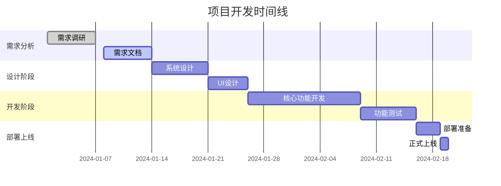
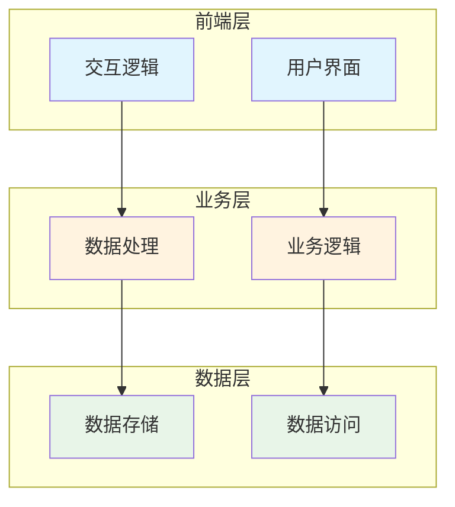
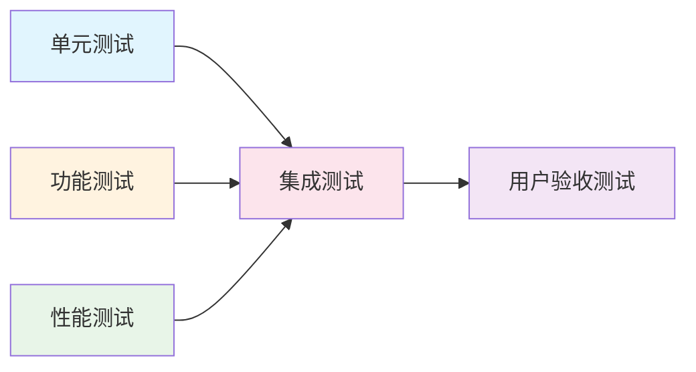
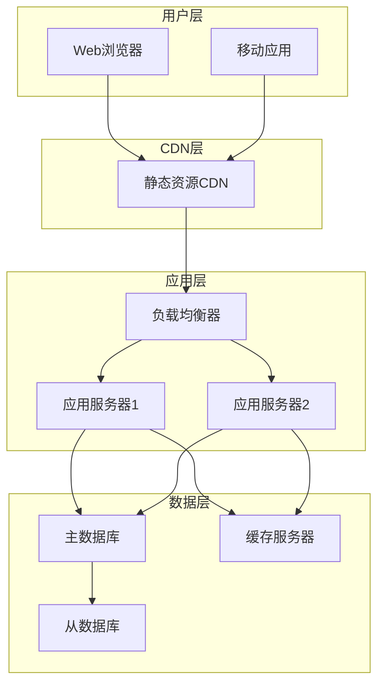

# 🚀 {{title}}

> [!info] 📋 项目信息
> **创建时间**: {{date:YYYY-MM-DD HH:mm}}
> **项目类型**: 🤖 AI项目 / 🔐 CTF挑战 / 📚 学习项目
> **技术栈**: 
> **难度等级**: `#基础` / `#进阶` / `#高级` / `#专家`
> **项目状态**: `#规划中` / `#开发中` / `#测试中` / `#已完成`

## 🎯 项目概述

```mermaid
mindmap
  root(({{title}}))
    需求分析
      功能需求
      性能需求
      用户需求
    技术架构
      前端技术
      后端技术
      数据库
    实现计划
      阶段一
      阶段二
      阶段三
    预期成果
      功能实现
      性能指标
      学习收获
```

> [!abstract] 🎨 项目愿景
> 在这里描述项目的核心理念、要解决的问题以及预期达到的效果。

### 📊 项目指标

| 指标类型 | 目标值 | 当前值 | 完成度 |
|----------|--------|--------|--------|
| 功能完成度 | 100% | 0% | 🔴 0% |
| 代码质量 | A级 | - | ⏳ 待评估 |
| 性能指标 | 目标值 | - | ⏳ 待测试 |
| 学习目标 | 100% | 0% | 🔴 0% |

## 🎯 项目目标

> [!goal] 🏆 核心目标
> 明确项目要达成的核心目标，确保项目方向正确。

### 🎯 功能目标
- [ ] **核心功能1**: 详细描述要实现的功能
- [ ] **核心功能2**: 详细描述要实现的功能
- [ ] **核心功能3**: 详细描述要实现的功能

### 📈 技术目标
- [ ] **技术目标1**: 要掌握的技术技能
- [ ] **技术目标2**: 要掌握的技术技能
- [ ] **技术目标3**: 要掌握的技术技能

### 🎓 学习目标
- [ ] **学习目标1**: 要获得的知识和能力
- [ ] **学习目标2**: 要获得的知识和能力
- [ ] **学习目标3**: 要获得的知识和能力

## 📅 项目计划



### 🗓️ 阶段一：需求分析与设计 (第1-2周)

> [!timeline] 📋 阶段目标
> 完成项目需求分析、技术选型和系统设计

**主要任务**:
- [ ] **需求调研** (3天)
  - [ ] 用户需求分析
  - [ ] 功能需求梳理
  - [ ] 非功能需求确定
  
- [ ] **技术选型** (2天)
  - [ ] 技术栈选择
  - [ ] 工具选择
  - [ ] 架构设计

- [ ] **系统设计** (3天)
  - [ ] 整体架构设计
  - [ ] 数据库设计
  - [ ] 接口设计

**交付物**:
- [ ] 需求文档
- [ ] 技术方案
- [ ] 系统设计文档

### 🗓️ 阶段二：核心开发 (第3-5周)

> [!timeline] 💻 阶段目标
> 完成核心功能开发和基础测试

**主要任务**:
- [ ] **环境搭建** (1天)
  - [ ] 开发环境配置
  - [ ] 项目结构创建
  - [ ] 基础框架搭建

- [ ] **核心功能开发** (10天)
  - [ ] 功能模块1开发
  - [ ] 功能模块2开发
  - [ ] 功能模块3开发

- [ ] **集成测试** (3天)
  - [ ] 单元测试
  - [ ] 集成测试
  - [ ] 性能测试

**交付物**:
- [ ] 核心功能代码
- [ ] 测试报告
- [ ] 技术文档

### 🗓️ 阶段三：优化部署 (第6-7周)

> [!timeline] 🚀 阶段目标
> 完成项目优化、部署和文档整理

**主要任务**:
- [ ] **功能优化** (5天)
  - [ ] 性能优化
  - [ ] 用户体验优化
  - [ ] 代码重构

- [ ] **部署上线** (3天)
  - [ ] 部署环境准备
  - [ ] 项目部署
  - [ ] 线上测试

- [ ] **文档整理** (2天)
  - [ ] 用户手册
  - [ ] 开发文档
  - [ ] 项目总结

**交付物**:
- [ ] 完整项目
- [ ] 部署文档
- [ ] 项目总结报告

## 🏗️ 技术架构



### 🛠️ 技术栈选择

> [!tech] 💻 技术选型理由

**前端技术**:
- **框架**: 选择的框架及理由
- **UI库**: 选择的UI库及理由
- **工具**: 开发工具选择

**后端技术**:
- **语言**: 编程语言选择及理由
- **框架**: 后端框架选择
- **数据库**: 数据库选择及理由

**部署运维**:
- **服务器**: 服务器选择
- **容器**: 容器化方案
- **监控**: 监控方案

## 🔧 核心功能设计

### 🎯 [[功能模块1]]

> [!feature] 🔍 功能描述
> 详细描述这个功能模块的作用、输入输出、处理逻辑等。

**技术要点**:
- 技术要点1: 详细说明
- 技术要点2: 详细说明

**实现难点**:
- 难点1: 问题描述和解决方案
- 难点2: 问题描述和解决方案

### 🎯 [[功能模块2]]

> [!feature] 🔍 功能描述
> 详细描述这个功能模块的作用、输入输出、处理逻辑等。

**技术要点**:
- 技术要点1: 详细说明
- 技术要点2: 详细说明

## 📊 项目进度跟踪

> [!progress] 📈 整体进度

<div class="progress-bar">
  <div class="progress-fill" style="width: 0%" data-progress="0%"></div>
</div>

### 📅 里程碑记录

| 里程碑 | 计划时间 | 实际时间 | 状态 | 备注 |
|--------|----------|----------|------|------|
| 需求分析完成 | 2024-01-14 | - | ⏳ 进行中 | - |
| 系统设计完成 | 2024-01-21 | - | ⏳ 待开始 | - |
| 核心功能完成 | 2024-02-11 | - | ⏳ 待开始 | - |
| 项目部署完成 | 2024-02-25 | - | ⏳ 待开始 | - |

### 📝 开发日志

> [!log] 📋 每日记录

**2024-01-01**:
- ✅ 完成项目初始化
- ✅ 搭建基础框架
- 🔄 进行需求调研

**2024-01-02**:
- 记录当天的开发进展
- 遇到的问题和解决方案
- 明天的计划

## 🧪 测试方案

> [!test] 🔬 测试策略

### 🧪 测试类型



**测试计划**:
- [ ] **单元测试**: 覆盖率目标 80%
- [ ] **集成测试**: 主要功能流程测试
- [ ] **性能测试**: 响应时间、并发量测试
- [ ] **用户测试**: 用户体验和易用性测试

### 📋 测试用例

| 测试项 | 测试方法 | 预期结果 | 实际结果 | 状态 |
|--------|----------|----------|----------|------|
| 功能1测试 | 测试步骤 | 预期结果 | - | ⏳ 待测试 |
| 功能2测试 | 测试步骤 | 预期结果 | - | ⏳ 待测试 |

## 🚀 部署方案

> [!deploy] 🌐 部署策略

### 🏗️ 部署架构



### 📋 部署清单

- [ ] **环境准备**
  - [ ] 服务器配置
  - [ ] 域名解析
  - [ ] SSL证书

- [ ] **应用部署**
  - [ ] 代码部署
  - [ ] 数据库迁移
  - [ ] 配置文件设置

- [ ] **监控配置**
  - [ ] 性能监控
  - [ ] 错误监控
  - [ ] 日志收集

## 📚 学习收获

> [!learning] 🎓 知识总结

### 💡 技术收获
- **新技术掌握**: 列出掌握的新技术
- **技能提升**: 描述技能的提升情况
- **最佳实践**: 总结学到的最佳实践

### 🤔 问题与解决
- **问题1**: 问题描述 → 解决方案 → 经验总结
- **问题2**: 问题描述 → 解决方案 → 经验总结

### 🔄 改进建议
- **技术改进**: 对技术选型和实现的改进建议
- **流程改进**: 对开发流程的改进建议
- **工具改进**: 对开发工具的改进建议

## 🔗 相关资源

> [!resources] 📖 参考资料

### 📚 技术文档
- [[相关技术文档]] - 技术文档说明
- [[API文档]] - 接口文档
- [[部署文档]] - 部署指南

### 🌐 在线资源
- [官方文档](链接) - 官方技术文档
- [教程网站](链接) - 相关教程
- [开源项目](链接) - 参考的开源项目

### 🛠️ 工具软件
- [[开发工具]] - 使用的开发工具
- [[测试工具]] - 测试工具介绍
- [[部署工具]] - 部署工具说明

## 🏷️ 标签

`#项目实战` `#技术栈` `#状态标签` `#学习成果`

---

> [!success] 🎉 项目完成标志
> 当项目达到以下标准时，可以标记为完成：
> - ✅ 所有核心功能正常运行
> - ✅ 测试用例全部通过
> - ✅ 成功部署到生产环境
> - ✅ 文档完整且准确
> - ✅ 达成所有学习目标

**📊 最后更新**: {{date:YYYY-MM-DD HH:mm}}
**🔗 相关项目**: [[]] | [[]] | [[]]
