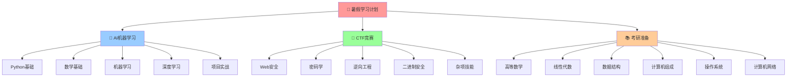

# 🧠 知识图谱总览 - 暑假学习计划

## 🎯 学习目标总览

### 📊 时间分配 (8周计划)
- **AI学习**: 40% (每天3小时)
- **CTF学习**: 35% (每天3小时)  
- **考研准备**: 25% (每天2-3小时)

### 🏆 最终成果目标
- [ ] 完成 [[AI项目作品集]] (3-5个项目)
- [ ] 达到 [[CTF中级水平]] (独立解题能力)
- [ ] 考研模拟 [[目标分数达成]] (各科目标分)

## 🗺️ 知识领域导航

### 🤖 [[AI学习路径图]]
**核心路径**: [[Python基础强化]] → [[数学基础复习]] → [[机器学习算法]] → [[深度学习框架]] → [[项目实战]]

**关键概念**:
- [[监督学习]] | [[无监督学习]] | [[强化学习]]
- [[神经网络]] | [[卷积神经网络]] | [[循环神经网络]]
- [[特征工程]] | [[模型评估]] | [[超参数调优]]

### 🔐 [[CTF技能树]]
**攻击路径**: [[Web安全基础]] → [[漏洞挖掘]] → [[渗透测试]] → [[高级攻防]]

**技术分支**:
- [[SQL注入]] | [[XSS攻击]] | [[文件上传]] | [[反序列化]]
- [[密码学基础]] | [[古典密码]] | [[现代密码]] | [[密码分析]]
- [[逆向分析]] | [[静态分析]] | [[动态调试]] | [[代码审计]]

### 📚 [[考研知识体系]]
**数学路径**: [[极限理论]] → [[微积分]] → [[线性代数]] → [[概率统计]]

**专业课路径**: [[数据结构]] → [[算法分析]] → [[计算机系统]] → [[网络原理]]

## 📈 学习进度追踪

### 第1-2周: 基础建立期
- [ ] [[Python高级特性掌握]]
- [ ] [[Web安全环境搭建]]
- [ ] [[高数极限连续复习]]

### 第3-4周: 技能提升期  
- [ ] [[机器学习算法实现]]
- [ ] [[CTF基础题目练习]]
- [ ] [[数据结构算法复习]]

### 第5-6周: 实战强化期
- [ ] [[AI项目开发]]
- [ ] [[CTF实战演练]]
- [ ] [[考研真题练习]]

### 第7-8周: 综合提升期
- [ ] [[项目优化部署]]
- [ ] [[CTF比赛模拟]]
- [ ] [[考研冲刺复习]]

## 🔗 知识关联网络

### 跨领域连接
- [[数学基础]] ↔ [[机器学习算法]] ↔ [[深度学习理论]]
- [[编程基础]] ↔ [[Web开发]] ↔ [[安全测试]]
- [[算法思维]] ↔ [[数据结构]] ↔ [[系统设计]]

### 技能迁移路径
- [[Python编程]] → [[数据分析]] → [[机器学习]]
- [[网络协议]] → [[Web安全]] → [[渗透测试]]
- [[数学思维]] → [[算法设计]] → [[系统优化]]

## 🏷️ 标签系统

### 学科标签
`#AI学习` `#CTF竞赛` `#考研准备`

### 难度标签  
`#基础` `#进阶` `#高级` `#专家`

### 类型标签
`#理论知识` `#实践技能` `#项目实战` `#考试重点`

### 状态标签
`#待学习` `#学习中` `#已掌握` `#需复习`

## 📚 学习资源库

### 在线课程
- [[机器学习课程推荐]]
- [[CTF训练平台]]
- [[考研视频资源]]

### 实践平台
- [[Kaggle竞赛]]
- [[CTF比赛平台]]
- [[算法练习网站]]

### 参考书籍
- [[AI学习书单]]
- [[网络安全书籍]]
- [[考研参考书目]]

---

**🎯 使用说明**: 
- 点击任何 `[[链接]]` 可跳转到对应的详细笔记
- 使用标签进行快速搜索和分类
- 定期更新学习进度和知识连接
- 利用图谱视图查看知识结构关系

**📊 图谱导航**: 
- 使用 Obsidian 的图谱视图查看完整知识网络
- 通过标签面板快速定位相关内容
- 利用搜索功能查找特定知识点
