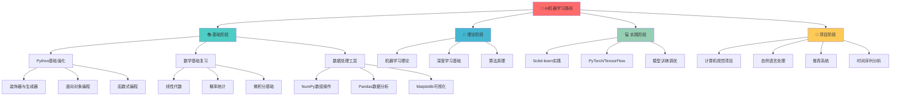

# 🤖 AI学习路径图



## 📋 学习路径详解

### 🎯 [[00-知识图谱总览]] ← 返回总览

## 📚 第一阶段：基础建立 (第1-2周)

### [[Python基础强化]]
**学习目标**: 掌握AI开发所需的Python高级特性

#### 核心概念
- [[装饰器模式]] - 函数增强和代码复用
- [[生成器与迭代器]] - 内存高效的数据处理
- [[上下文管理器]] - 资源管理和异常处理
- [[元类编程]] - 动态类创建和修改
- [[函数式编程]] - 高阶函数和函数组合

#### 实践项目
- [ ] [[Python性能优化实验]]
- [ ] [[数据处理工具包开发]]
- [ ] [[装饰器库设计]]

**关联知识**: [[编程范式]] | [[代码优化]] | [[设计模式]]

### [[数学基础复习]]
**学习目标**: 巩固AI算法的数学理论基础

#### [[线性代数]]
- [[向量运算]] - 点积、叉积、投影
- [[矩阵运算]] - 乘法、转置、逆矩阵
- [[特征值分解]] - 主成分分析基础
- [[奇异值分解]] - 降维和数据压缩

#### [[概率统计]]
- [[贝叶斯定理]] - 机器学习的概率基础
- [[概率分布]] - 正态分布、伯努利分布
- [[中心极限定理]] - 统计推断基础
- [[假设检验]] - 模型验证方法

#### [[微积分基础]]
- [[导数与梯度]] - 优化算法基础
- [[偏导数]] - 多元函数优化
- [[链式法则]] - 反向传播算法
- [[泰勒展开]] - 函数近似

**关联知识**: [[优化理论]] | [[统计学习]] | [[信息论]]

### [[数据处理工具]]
**学习目标**: 熟练使用数据科学工具栈

#### [[NumPy数组操作]]
- [[数组创建与索引]] - 高效数据结构
- [[广播机制]] - 向量化计算
- [[线性代数运算]] - 矩阵计算加速
- [[随机数生成]] - 数据模拟

#### [[Pandas数据分析]]
- [[DataFrame操作]] - 结构化数据处理
- [[数据清洗]] - 缺失值和异常值处理
- [[数据变换]] - 特征工程基础
- [[时间序列]] - 时序数据分析

#### [[数据可视化]]
- [[Matplotlib基础]] - 静态图表绘制
- [[Seaborn统计图]] - 统计可视化
- [[Plotly交互图]] - 动态可视化
- [[数据探索可视化]] - EDA技术

**实践项目**: [[数据分析项目集]]

## 🧮 第二阶段：理论深入 (第3-4周)

### [[机器学习理论]]
**学习目标**: 理解机器学习核心算法原理

#### [[监督学习]]
- [[线性回归]] - 最小二乘法、梯度下降
- [[逻辑回归]] - 分类问题、sigmoid函数
- [[决策树]] - 信息增益、剪枝策略
- [[支持向量机]] - 核技巧、间隔最大化
- [[集成学习]] - Bagging、Boosting、随机森林

#### [[无监督学习]]
- [[K-means聚类]] - 质心算法、肘部法则
- [[层次聚类]] - 凝聚与分裂策略
- [[主成分分析]] - 降维技术
- [[关联规则]] - 频繁项集挖掘

#### [[模型评估]]
- [[交叉验证]] - K折验证、留一验证
- [[评估指标]] - 准确率、召回率、F1分数
- [[ROC曲线]] - 分类器性能评估
- [[偏差方差权衡]] - 过拟合与欠拟合

**关联知识**: [[统计学习理论]] | [[优化算法]] | [[信息论]]

### [[深度学习基础]]
**学习目标**: 掌握神经网络基本原理

#### [[神经网络基础]]
- [[感知机模型]] - 线性分类器
- [[多层感知机]] - 非线性映射
- [[激活函数]] - ReLU、Sigmoid、Tanh
- [[反向传播]] - 梯度计算与更新

#### [[深度网络架构]]
- [[卷积神经网络]] - 图像处理专用
- [[循环神经网络]] - 序列数据处理
- [[长短期记忆网络]] - 长序列建模
- [[注意力机制]] - Transformer基础

#### [[训练技巧]]
- [[梯度下降优化]] - SGD、Adam、RMSprop
- [[正则化技术]] - Dropout、BatchNorm
- [[学习率调度]] - 学习率衰减策略
- [[损失函数设计]] - 交叉熵、MSE

**实践项目**: [[神经网络从零实现]]

## 💻 第三阶段：框架实践 (第5-6周)

### [[深度学习框架]]
**学习目标**: 熟练使用主流深度学习框架

#### [[PyTorch实践]]
- [[张量操作]] - Tensor基础操作
- [[自动微分]] - Autograd机制
- [[模型构建]] - nn.Module使用
- [[数据加载]] - DataLoader和Dataset
- [[模型训练]] - 训练循环设计
- [[模型保存]] - 检查点和部署

#### [[TensorFlow/Keras]]
- [[Keras高级API]] - 快速原型开发
- [[自定义层]] - 复杂模型构建
- [[回调函数]] - 训练过程控制
- [[TensorBoard]] - 训练可视化

**实践项目**: [[深度学习框架对比]]

### [[计算机视觉]]
**学习目标**: 掌握图像处理和计算机视觉技术

#### [[图像处理基础]]
- [[图像预处理]] - 缩放、裁剪、增强
- [[特征提取]] - 边缘检测、角点检测
- [[图像分割]] - 语义分割、实例分割
- [[目标检测]] - YOLO、R-CNN系列

#### [[经典CNN架构]]
- [[LeNet]] - 手写数字识别
- [[AlexNet]] - ImageNet突破
- [[VGG]] - 深度网络设计
- [[ResNet]] - 残差连接
- [[Inception]] - 多尺度特征

**实践项目**: [[图像分类项目]] | [[目标检测项目]]

### [[自然语言处理]]
**学习目标**: 理解文本处理和语言模型

#### [[文本预处理]]
- [[分词技术]] - 中英文分词
- [[词向量]] - Word2Vec、GloVe
- [[文本清洗]] - 去噪、标准化
- [[特征工程]] - TF-IDF、N-gram

#### [[语言模型]]
- [[循环神经网络]] - 序列建模
- [[Transformer]] - 注意力机制
- [[BERT]] - 预训练语言模型
- [[GPT]] - 生成式语言模型

**实践项目**: [[文本分类项目]] | [[情感分析项目]]

## 🚀 第四阶段：项目实战 (第7-8周)

### [[综合项目开发]]
**学习目标**: 完成端到端的AI项目

#### [[项目规划]]
- [[需求分析]] - 问题定义和目标设定
- [[数据收集]] - 数据源识别和获取
- [[技术选型]] - 算法和框架选择
- [[项目管理]] - 时间规划和里程碑

#### [[项目实施]]
- [[数据探索]] - EDA和数据理解
- [[特征工程]] - 特征选择和构造
- [[模型开发]] - 算法实现和调优
- [[模型评估]] - 性能测试和验证
- [[模型部署]] - 生产环境部署

#### [[项目优化]]
- [[性能调优]] - 速度和精度优化
- [[可解释性]] - 模型解释和可视化
- [[监控运维]] - 模型监控和更新
- [[文档编写]] - 技术文档和用户手册

**核心项目**:
- [ ] [[房价预测系统]] - 回归问题完整流程
- [ ] [[图像识别应用]] - 深度学习端到端
- [ ] [[推荐系统]] - 协同过滤和深度学习
- [ ] [[时间序列预测]] - 股价/销量预测

## 🔗 知识关联图

### 技能依赖关系
```
Python基础 → 数据处理 → 机器学习 → 深度学习 → 项目实战
     ↓           ↓           ↓           ↓           ↓
   编程思维 → 数据思维 → 算法思维 → 模型思维 → 工程思维
```

### 跨领域连接
- [[数学基础]] ↔ [[算法理论]] ↔ [[模型优化]]
- [[编程技能]] ↔ [[工程实践]] ↔ [[系统设计]]
- [[统计学习]] ↔ [[机器学习]] ↔ [[深度学习]]

## 📊 学习进度跟踪

### 每周目标检查
- [ ] 第1周: [[Python高级特性]] + [[数学基础]]
- [ ] 第2周: [[数据处理工具]] + [[机器学习入门]]
- [ ] 第3周: [[监督学习算法]] + [[模型评估]]
- [ ] 第4周: [[无监督学习]] + [[深度学习基础]]
- [ ] 第5周: [[CNN实践]] + [[计算机视觉]]
- [ ] 第6周: [[RNN实践]] + [[自然语言处理]]
- [ ] 第7周: [[项目开发]] + [[模型优化]]
- [ ] 第8周: [[项目部署]] + [[成果展示]]

### 技能掌握度评估
- 🔴 未开始 🟡 学习中 🟢 已掌握 🔵 精通

## 🏷️ 相关标签
`#AI学习` `#机器学习` `#深度学习` `#Python` `#数据科学` `#项目实战`

## 📚 推荐资源
- [[AI学习书单]] - 经典教材推荐
- [[在线课程]] - 视频教程资源
- [[实践平台]] - Kaggle、Google Colab
- [[开源项目]] - GitHub优秀项目

---
**导航**: [[00-知识图谱总览]] | [[CTF技能树]] | [[考研知识体系]]
