# 🔐 CTF技能树

```mermaid
graph TD
    A[🔐 CTF竞赛技能] --> B[🌐 Web安全]
    A --> C[🔒 密码学]
    A --> D[🔍 逆向工程]
    A --> E[💥 二进制安全]
    A --> F[🧩 杂项技能]
    
    B --> B1[注入攻击]
    B --> B2[XSS攻击]
    B --> B3[文件上传]
    B --> B4[反序列化]
    B --> B5[SSRF/XXE]
    
    C --> C1[古典密码]
    C --> C2[现代密码]
    C --> C3[哈希函数]
    C --> C4[数字签名]
    C --> C5[密码分析]
    
    D --> D1[静态分析]
    D --> D2[动态调试]
    D --> D3[代码审计]
    D --> D4[脱壳技术]
    D --> D5[反混淆]
    
    E --> E1[栈溢出]
    E --> E2[堆溢出]
    E --> E3[格式化字符串]
    E --> E4[ROP/JOP]
    E --> E5[内核利用]
    
    F --> F1[隐写术]
    F --> F2[取证分析]
    F --> F3[网络协议]
    F --> F4[编程解题]
    F --> F5[社会工程]
    
    style A fill:#ff4757
    style B fill:#2ed573
    style C fill:#1e90ff
    style D fill:#ffa502
    style E fill:#ff6b81
    style F fill:#a55eea
```



## 🎯 [[00-知识图谱总览]] ← 返回总览

## 🌐 Web安全分支

### [[SQL注入攻击]]
**技能等级**: 🔴基础 → 🟡进阶 → 🟢高级 → 🔵专家

#### 基础技能 🔴
- [[联合注入]] - Union Select基础
- [[布尔盲注]] - 真假条件判断
- [[时间盲注]] - 延时函数利用
- [[报错注入]] - 错误信息利用

#### 进阶技能 🟡
- [[WAF绕过]] - 防火墙规避技术
- [[二次注入]] - 存储型SQL注入
- [[宽字节注入]] - 编码绕过
- [[堆叠查询]] - 多语句执行

#### 高级技能 🟢
- [[NoSQL注入]] - MongoDB/Redis注入
- [[ORM注入]] - 框架层面注入
- [[存储过程注入]] - 数据库函数利用
- [[DNS外带]] - 无回显数据获取

#### 专家技能 🔵
- [[自动化注入工具开发]]
- [[0day SQL注入挖掘]]
- [[数据库提权技术]]

**实战项目**: [[SQL注入靶场]] | [[注入工具开发]]

### [[XSS跨站脚本]]
**攻击类型分析**

#### [[反射型XSS]]
- [[URL参数注入]] - GET参数利用
- [[POST数据注入]] - 表单数据利用
- [[HTTP头注入]] - User-Agent等头部
- [[Cookie注入]] - Cookie值利用

#### [[存储型XSS]]
- [[评论系统]] - 用户评论存储
- [[个人资料]] - 用户信息存储
- [[文件上传]] - 文件名/内容存储
- [[数据库存储]] - 持久化存储

#### [[DOM型XSS]]
- [[JavaScript漏洞]] - 客户端代码缺陷
- [[URL Fragment]] - #后参数利用
- [[PostMessage]] - 跨窗口通信
- [[WebSocket]] - 实时通信协议

#### 绕过技术
- [[过滤器绕过]] - 黑名单规避
- [[编码绕过]] - HTML/URL/Unicode编码
- [[事件处理器]] - onclick/onload等
- [[无脚本标签]] - CSS/SVG注入

**实战项目**: [[XSS平台搭建]] | [[Payload收集器]]

### [[文件上传漏洞]]
**绕过技术树**

#### 检测绕过
- [[前端检测]] - JavaScript验证绕过
- [[MIME类型]] - Content-Type伪造
- [[文件扩展名]] - 黑白名单绕过
- [[文件内容]] - 文件头伪造

#### 高级绕过
- [[条件竞争]] - 上传后快速访问
- [[二次渲染]] - 图片处理后利用
- [[解析漏洞]] - 服务器解析缺陷
- [[路径遍历]] - 目录穿越攻击

**关联技能**: [[Web Shell]] | [[代码执行]] | [[权限提升]]

## 🔒 密码学分支

### [[古典密码学]]
**历史密码系统**

#### 替换密码
- [[凯撒密码]] - 字母移位加密
- [[维吉尼亚密码]] - 多表替换
- [[仿射密码]] - 数学变换
- [[希尔密码]] - 矩阵加密

#### 置换密码
- [[栅栏密码]] - 简单置换
- [[列置换密码]] - 矩阵置换
- [[路径密码]] - 特定路径读取

**破解技术**: [[频率分析]] | [[重合指数]] | [[卡方检验]]

### [[现代密码学]]
**对称加密系统**

#### 分组密码
- [[DES算法]] - 数据加密标准
- [[AES算法]] - 高级加密标准
- [[工作模式]] - ECB/CBC/CFB/OFB/CTR
- [[填充攻击]] - Padding Oracle

#### 流密码
- [[RC4算法]] - 流密码实现
- [[线性反馈移位寄存器]] - LFSR
- [[密钥流生成]] - 伪随机序列

**非对称加密**
- [[RSA算法]] - 大数分解
- [[椭圆曲线]] - ECC加密
- [[数字签名]] - DSA/ECDSA
- [[密钥交换]] - DH/ECDH

### [[密码分析]]
**攻击技术**

#### RSA攻击
- [[小指数攻击]] - e=3攻击
- [[共模攻击]] - 相同模数
- [[维纳攻击]] - 小私钥指数
- [[费马分解]] - 接近因子

#### 哈希攻击
- [[生日攻击]] - 碰撞概率
- [[长度扩展]] - Merkle-Damgård结构
- [[彩虹表]] - 预计算攻击
- [[字典攻击]] - 常见密码

**实战项目**: [[密码破解工具]] | [[加密算法实现]]

## 🔍 逆向工程分支

### [[静态分析]]
**工具与技术**

#### 反汇编工具
- [[IDA Pro]] - 专业反汇编器
- [[Ghidra]] - NSA开源工具
- [[x64dbg]] - Windows调试器
- [[Radare2]] - 命令行工具

#### 分析技术
- [[控制流分析]] - 程序执行路径
- [[数据流分析]] - 变量传播
- [[函数识别]] - 库函数识别
- [[字符串分析]] - 关键信息提取

### [[动态调试]]
**运行时分析**

#### 调试技术
- [[断点设置]] - 程序暂停点
- [[单步执行]] - 逐指令分析
- [[内存监控]] - 数据变化跟踪
- [[API监控]] - 系统调用跟踪

#### 反调试对抗
- [[调试器检测]] - IsDebuggerPresent
- [[时间检测]] - 执行时间异常
- [[异常处理]] - SEH反调试
- [[硬件断点]] - DR寄存器检测

### [[代码保护]]
**对抗技术**

#### 混淆技术
- [[控制流混淆]] - 跳转复杂化
- [[数据混淆]] - 变量加密
- [[指令替换]] - 等价指令
- [[垃圾代码]] - 无用指令插入

#### 加壳技术
- [[压缩壳]] - UPX等压缩
- [[加密壳]] - 代码加密
- [[虚拟机壳]] - VM保护
- [[反调试壳]] - 调试对抗

**实战项目**: [[脱壳工具开发]] | [[混淆代码分析]]

## 💥 二进制安全分支

### [[栈溢出攻击]]
**基础到高级**

#### 基础概念
- [[栈结构]] - 函数调用栈
- [[缓冲区溢出]] - 边界检查缺失
- [[返回地址覆盖]] - 控制流劫持
- [[Shellcode]] - 机器码注入

#### 保护机制
- [[栈金丝雀]] - Stack Canary
- [[ASLR]] - 地址空间随机化
- [[NX位]] - 数据执行保护
- [[FORTIFY]] - 编译器保护

#### 绕过技术
- [[ROP链]] - 返回导向编程
- [[JOP链]] - 跳转导向编程
- [[栈迁移]] - 栈指针劫持
- [[格式化字符串]] - printf族漏洞

### [[堆溢出攻击]]
**堆管理机制**

#### 堆结构
- [[ptmalloc]] - glibc堆管理
- [[tcache]] - 线程缓存
- [[fastbin]] - 快速分配
- [[unsorted bin]] - 未排序链表

#### 攻击技术
- [[UAF]] - Use After Free
- [[Double Free]] - 重复释放
- [[堆风水]] - 堆布局控制
- [[House系列]] - 经典堆利用

**实战项目**: [[PWN题目练习]] | [[漏洞利用开发]]

## 🧩 杂项技能分支

### [[隐写术]]
**信息隐藏技术**

#### 图像隐写
- [[LSB隐写]] - 最低有效位
- [[DCT隐写]] - 离散余弦变换
- [[盲水印]] - 不可见水印
- [[EXIF信息]] - 元数据隐藏

#### 音频隐写
- [[波形分析]] - 音频波形
- [[频谱分析]] - 频域隐写
- [[回声隐写]] - 时域技术

#### 其他载体
- [[文本隐写]] - 零宽字符
- [[网络隐写]] - 协议隐写
- [[文件系统]] - 文件隐藏

### [[数字取证]]
**证据收集与分析**

#### 磁盘取证
- [[文件恢复]] - 删除文件恢复
- [[时间线分析]] - 事件时序
- [[注册表分析]] - Windows注册表
- [[日志分析]] - 系统日志

#### 网络取证
- [[流量分析]] - Wireshark使用
- [[协议分析]] - TCP/IP协议栈
- [[恶意流量]] - 攻击特征识别
- [[数据重组]] - 会话重建

#### 内存取证
- [[内存镜像]] - 内存快照
- [[进程分析]] - 运行进程
- [[网络连接]] - 活动连接
- [[恶意代码]] - 内存中恶意程序

**实战项目**: [[取证工具使用]] | [[案例分析]]

## 🔗 技能关联网络

### 技能依赖关系
```
基础知识 → 工具使用 → 漏洞发现 → 漏洞利用 → 防护绕过
    ↓         ↓         ↓         ↓         ↓
  理论基础 → 实践能力 → 分析能力 → 利用能力 → 对抗能力
```

### 跨领域技能
- [[编程能力]] ↔ [[脚本开发]] ↔ [[工具制作]]
- [[网络知识]] ↔ [[协议分析]] ↔ [[流量分析]]
- [[系统原理]] ↔ [[漏洞理解]] ↔ [[利用开发]]

## 📊 技能等级评估

### 入门级 (0-3个月)
- [ ] 基础工具使用
- [ ] 简单题目求解
- [ ] 基础概念理解

### 进阶级 (3-6个月)
- [ ] 中等难度题目
- [ ] 工具脚本编写
- [ ] 漏洞原理理解

### 高级 (6-12个月)
- [ ] 复杂题目求解
- [ ] 0day漏洞挖掘
- [ ] 工具开发能力

### 专家级 (1年以上)
- [ ] 比赛获奖经历
- [ ] 原创研究成果
- [ ] 社区贡献

## 🏆 实战训练计划

### 每周训练目标
- [ ] 第1-2周: [[Web安全基础]] + [[工具环境搭建]]
- [ ] 第3-4周: [[密码学基础]] + [[逆向入门]]
- [ ] 第5-6周: [[二进制安全]] + [[综合题目]]
- [ ] 第7-8周: [[比赛模拟]] + [[弱项强化]]

### 推荐平台
- [[CTF训练平台]] - 在线练习
- [[靶场环境]] - 本地搭建
- [[比赛参与]] - 实战经验

## 🏷️ 相关标签
`#CTF竞赛` `#网络安全` `#渗透测试` `#漏洞挖掘` `#安全研究`

---
**导航**: [[00-知识图谱总览]] | [[AI学习路径图]] | [[考研知识体系]]
