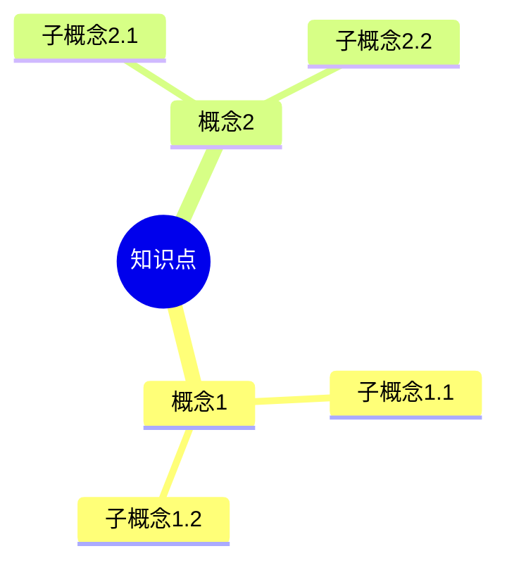
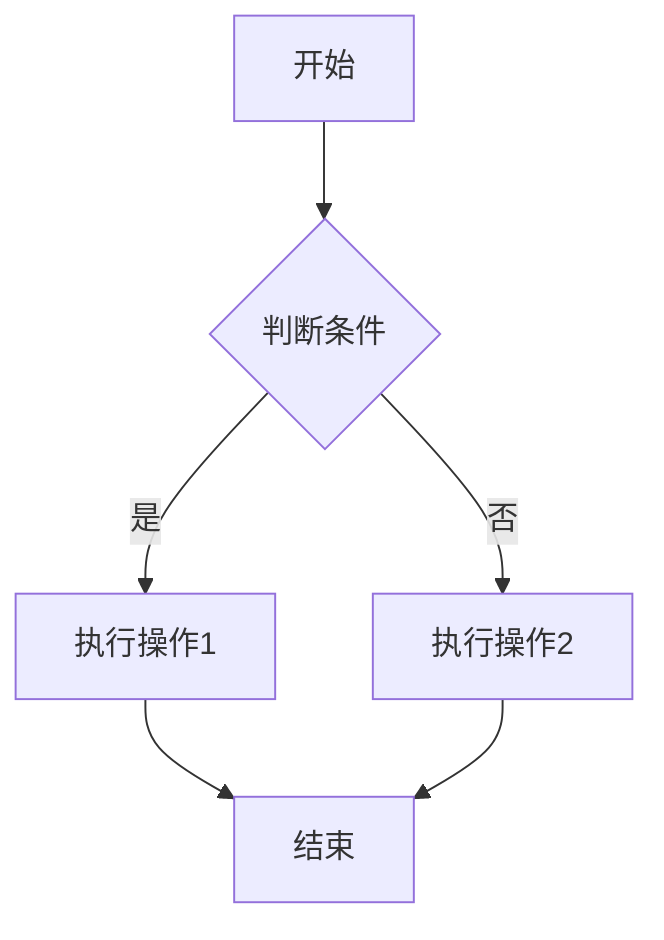
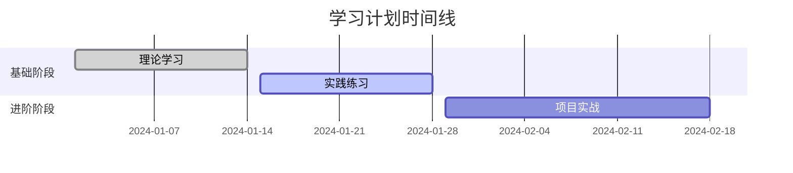
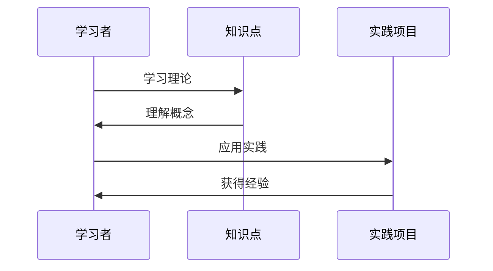
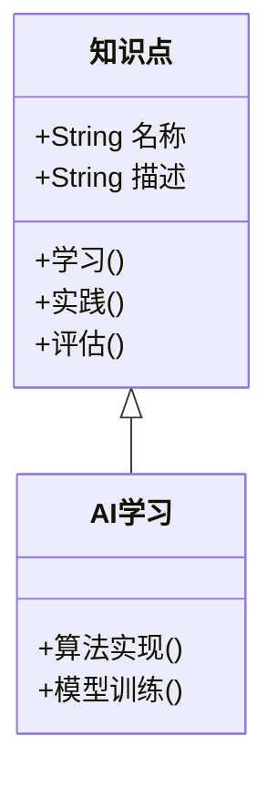
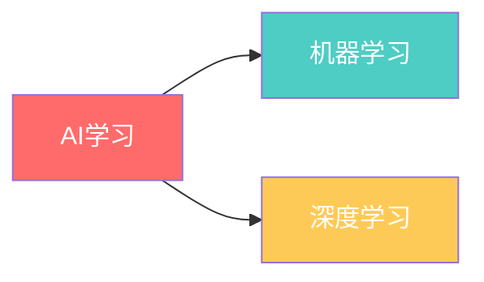
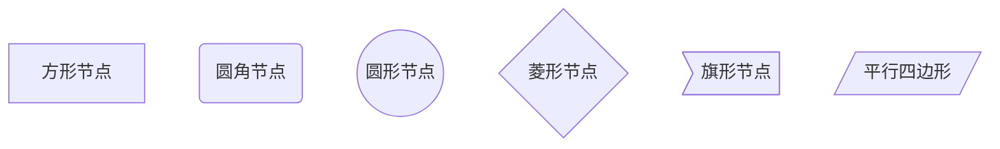

# 🎨 Obsidian完整使用指南 - 高级知识图谱系统

> [!info] 📋 指南概述
> 这是一个专门为您的暑假学习计划设计的Obsidian高级模板系统，包含美观的样式、完整的Mermaid图表支持和智能的知识管理功能。

## 🚀 快速开始

### 第一步：安装和配置

1. **下载Obsidian**
   - 访问 [Obsidian官网](https://obsidian.md/)
   - 下载适合您系统的版本
   - 安装并启动Obsidian

2. **打开项目库**
   - 点击"打开文件夹作为库"
   - 选择您的 `summer_study_plan-main` 文件夹
   - Obsidian会自动识别并加载配置

3. **启用CSS样式**
   - 进入 `设置` → `外观` → `CSS代码片段`
   - 确保 `advanced-knowledge-graph` 已启用
   - 重启Obsidian以应用样式

### 第二步：基础设置

> [!settings] ⚙️ 推荐设置

**核心插件启用**:
- [x] 图谱视图
- [x] 大纲
- [x] 标签面板
- [x] 文件恢复
- [x] 模板
- [x] 日记

**编辑器设置**:
- [x] 实时预览模式
- [x] 显示行号
- [x] 显示缩进参考线
- [x] 折叠标题和缩进

## 🎨 高级样式特性

### 🌈 颜色主题系统

我们的CSS样式包含了完整的颜色主题：

```css
/* 学科颜色编码 */
🔴 AI学习: #ff6b6b (红色系) - 代表创新技术
🔵 CTF竞赛: #4ecdc4 (蓝绿色) - 代表安全防护
🟡 考研准备: #feca57 (黄色系) - 代表学术知识
🟢 项目实战: #48dbfb (天蓝色) - 代表实践成长
🟣 工具资源: #a55eea (紫色系) - 代表工具方法
```

### 🏷️ 智能标签系统

标签会自动应用对应的颜色和样式：

- **学科标签**: `#AI学习` `#CTF竞赛` `#考研准备`
- **难度标签**: `#基础` `#进阶` `#高级` `#专家`
- **状态标签**: `#待学习` `#学习中` `#已掌握` `#需复习`
- **类型标签**: `#理论知识` `#实践技能` `#项目实战`

### 📊 增强的UI组件

#### 进度条组件

<div class="progress-bar">
  <div class="progress-fill" style="width: 75%" data-progress="75%"></div>
</div>


#### 知识卡片

> [!note] 💡 知识卡片
> 这是一个美观的知识卡片，用于突出重要信息


#### 时间线组件
<div class="timeline">
  <div class="timeline-item">
    <h4>第一阶段</h4>
    <p>阶段描述内容</p>
  </div>
</div>


## 📝 模板系统使用

### 🎯 知识点模板

**使用方法**:
1. 按 `Ctrl+T` 或点击模板按钮
2. 选择"知识点模板"
3. 填写标题和相关信息
4. 系统会自动生成结构化的知识点文档

**模板特性**:
- 📊 自动生成Mermaid思维导图
- 🎯 结构化的学习目标设置
- 🔗 智能的知识关联系统
- 📈 进度跟踪和评估功能

### 🚀 项目实战模板

**使用方法**:
1. 创建新文档
2. 应用"项目实战模板"
3. 根据项目类型填写信息
4. 使用甘特图规划项目时间线

**模板特性**:
- 📅 甘特图项目时间线
- 🏗️ 技术架构图表
- 📊 进度跟踪表格
- 🧪 完整的测试方案

### 📅 学习计划模板

**使用方法**:
1. 制定学习计划时使用
2. 设置具体的学习目标
3. 规划详细的时间安排
4. 建立进度监控机制

**模板特性**:
- 🎯 SMART目标设置
- ⏰ 详细时间规划
- 📊 可视化进度跟踪
- 🔄 风险管理机制

## 🧠 Mermaid图表完全指南

### 📊 支持的图表类型

#### 1. 思维导图 (Mindmap)


#### 2. 流程图 (Flowchart)


#### 3. 甘特图 (Gantt)


#### 4. 序列图 (Sequence)


#### 5. 类图 (Class)


### 🎨 图表样式定制

#### 颜色主题


#### 节点形状


## 🔗 知识图谱最佳实践

### 📋 链接策略

#### 1. 双向链接
```markdown
[[知识点名称]] - 创建双向链接
[[知识点名称|显示文本]] - 带别名的链接
```

#### 2. 块引用
```markdown
[[文件名#标题]] - 链接到特定标题
[[文件名^块ID]] - 链接到特定块
```

#### 3. 嵌入内容
```markdown
![[文件名]] - 嵌入整个文件
![[文件名#标题]] - 嵌入特定部分
```

### 🏷️ 标签最佳实践

#### 1. 层次化标签
```markdown
#AI学习/机器学习/监督学习
#CTF竞赛/Web安全/SQL注入
#考研准备/数学/高等数学
```

#### 2. 状态标签
```markdown
#待学习 #学习中 #已掌握 #需复习
```

#### 3. 优先级标签
```markdown
#高优先级 #中优先级 #低优先级
```

### 📊 图谱视图优化

#### 1. 颜色分组
- 按学科分组：不同颜色代表不同学科
- 按难度分组：颜色深浅表示难度等级
- 按状态分组：颜色表示学习状态

#### 2. 节点大小
- 根据链接数量调整节点大小
- 重要概念使用更大的节点
- 基础概念使用中等节点

#### 3. 布局优化
- 核心概念居中显示
- 相关概念聚集分布
- 使用力导向算法自动布局

## 🛠️ 高级功能

### 📊 Dataview查询

#### 1. 学习进度统计
```dataview
TABLE 
  choice(contains(string(file.tags), "已掌握"), "✅", 
         contains(string(file.tags), "学习中"), "🔄", 
         contains(string(file.tags), "待学习"), "⏳", "❓") as "状态"
FROM #AI学习 OR #CTF竞赛 OR #考研准备
SORT file.mtime DESC
```

#### 2. 任务列表
```dataview
TASK
FROM #学习任务
WHERE !completed
SORT priority DESC
```

#### 3. 知识关联度分析
```dataview
TABLE 
  length(file.outlinks) as "链出",
  length(file.inlinks) as "链入",
  length(file.outlinks) + length(file.inlinks) as "总关联度"
FROM ""
WHERE length(file.outlinks) > 3 OR length(file.inlinks) > 3
SORT (length(file.outlinks) + length(file.inlinks)) DESC
```

### 🔍 高级搜索

#### 1. 组合搜索
```
tag:#AI学习 path:"基础知识" content:"机器学习"
```

#### 2. 正则表达式搜索
```
/\b(算法|模型|训练)\b/
```

#### 3. 属性搜索
```
file:(created:2024-01-01 modified:2024-01-31)
```

## 📱 移动端优化

### 📲 响应式设计
- 自动适配手机和平板屏幕
- 触摸友好的界面元素
- 优化的字体大小和间距

### 🔄 同步设置
- 使用Obsidian Sync进行多设备同步
- 或使用Git进行版本控制
- 确保配置文件同步

## 🎯 学习工作流

### 📅 每日工作流
1. **晨间回顾** (10分钟)
   - 查看今日学习计划
   - 回顾昨日学习成果
   - 调整当日目标

2. **学习记录** (学习过程中)
   - 使用模板创建学习笔记
   - 及时记录重点和疑问
   - 建立知识点之间的链接

3. **晚间总结** (15分钟)
   - 更新学习进度
   - 整理当日学习成果
   - 规划明日学习内容

### 📊 周度工作流
1. **周计划制定** (30分钟)
   - 使用学习计划模板
   - 设置具体的周目标
   - 分配每日学习任务

2. **周进度回顾** (30分钟)
   - 统计学习完成情况
   - 分析学习效果
   - 调整下周计划

### 🎯 项目工作流
1. **项目启动**
   - 使用项目模板创建项目文档
   - 制定详细的项目计划
   - 设置里程碑和检查点

2. **项目执行**
   - 定期更新项目进度
   - 记录遇到的问题和解决方案
   - 维护项目文档

3. **项目总结**
   - 整理项目成果
   - 总结经验教训
   - 更新知识库

## 🏷️ 标签
`#Obsidian` `#知识图谱` `#学习系统` `#模板` `#高级功能`

---

> [!success] 🎉 开始您的高效学习之旅
> 
> 现在您已经掌握了完整的Obsidian高级知识图谱系统！
> 
> **下一步行动**:
> 1. 🚀 从 [[00-知识图谱总览]] 开始探索
> 2. 📝 使用模板创建您的第一个学习笔记
> 3. 🔗 建立知识点之间的关联
> 4. 📊 查看美观的知识图谱视图
> 
> **记住**: 好的工具只是开始，持续的学习和实践才是成功的关键！💪

**📊 最后更新**: 2024-01-01
**🔗 相关文档**: [[Obsidian配置指南]] | [[00-知识图谱总览]] | [[学习进度跟踪]]
