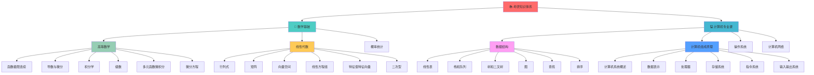

# 📚 考研知识体系



## 🎯 [[00-知识图谱总览]] ← 返回总览

## 📐 数学基础模块

### [[高等数学一]]
**学习目标**: 掌握微积分理论与计算方法

#### 第一章：[[函数极限连续]]
**核心概念**:
- [[函数概念]] - 定义域、值域、复合函数
- [[极限理论]] - 数列极限、函数极限
- [[连续性]] - 连续定义、间断点分类
- [[重要极限]] - 两个重要极限及应用

**重点内容**:
- [[极限计算]] - 洛必达法则、等价无穷小
- [[连续函数性质]] - 最值定理、中间值定理
- [[间断点判断]] - 第一类、第二类间断点

**考试重点**: 极限计算(30%) | 连续性讨论(25%) | 应用题(20%)

#### 第二章：[[导数与微分]]
**核心概念**:
- [[导数定义]] - 几何意义、物理意义
- [[求导法则]] - 四则运算、复合函数、反函数
- [[高阶导数]] - 莱布尼兹公式、常见函数n阶导数
- [[微分概念]] - 微分定义、微分应用

**重点内容**:
- [[隐函数求导]] - 隐函数微分法
- [[参数方程求导]] - 参数方程的导数
- [[微分中值定理]] - 罗尔定理、拉格朗日定理

#### 第三章：[[积分学]]
**核心概念**:
- [[不定积分]] - 原函数、基本积分公式
- [[定积分]] - 定积分定义、几何意义
- [[积分计算]] - 换元法、分部积分法
- [[积分应用]] - 面积、体积、弧长

**重点内容**:
- [[牛顿-莱布尼兹公式]] - 微积分基本定理
- [[反常积分]] - 无穷区间、无界函数积分
- [[定积分应用]] - 几何应用、物理应用

#### 第四章：[[多元函数微积分]]
**核心概念**:
- [[多元函数]] - 二元函数、定义域
- [[偏导数]] - 偏导数定义、几何意义
- [[全微分]] - 全微分定义、可微条件
- [[多元函数极值]] - 无条件极值、条件极值

**重点内容**:
- [[复合函数求导]] - 链式法则
- [[隐函数求导]] - 隐函数定理
- [[二重积分]] - 直角坐标、极坐标

**关联知识**: [[线性代数]] | [[概率统计]] | [[数值分析]]

### [[线性代数]]
**学习目标**: 掌握线性代数理论与计算

#### 第一章：[[行列式]]
**核心概念**:
- [[行列式定义]] - n阶行列式定义
- [[行列式性质]] - 行列式的基本性质
- [[行列式计算]] - 展开定理、化简方法
- [[克拉默法则]] - 线性方程组求解

#### 第二章：[[矩阵]]
**核心概念**:
- [[矩阵运算]] - 加法、乘法、转置
- [[逆矩阵]] - 逆矩阵定义、求法
- [[矩阵的秩]] - 秩的定义、计算方法
- [[分块矩阵]] - 分块运算法则

#### 第三章：[[向量]]
**核心概念**:
- [[向量组]] - 线性相关、线性无关
- [[向量空间]] - 基、维数、坐标
- [[线性变换]] - 变换矩阵、特征值

#### 第四章：[[线性方程组]]
**核心概念**:
- [[齐次线性方程组]] - 基础解系、通解
- [[非齐次线性方程组]] - 解的结构、特解
- [[解的判定]] - 系数矩阵、增广矩阵的秩

#### 第五章：[[特征值与特征向量]]
**核心概念**:
- [[特征值]] - 特征多项式、特征方程
- [[特征向量]] - 特征向量的求法
- [[矩阵对角化]] - 相似矩阵、对角化条件

#### 第六章：[[二次型]]
**核心概念**:
- [[二次型]] - 二次型的矩阵表示
- [[标准形]] - 配方法、正交变换
- [[正定性]] - 正定、负定、不定

**关联知识**: [[高等数学]] | [[概率统计]] | [[数值计算]]

### [[概率论与数理统计]]
**学习目标**: 掌握概率理论与统计方法

#### 第一章：[[随机事件与概率]]
**核心概念**:
- [[随机事件]] - 样本空间、事件运算
- [[概率定义]] - 古典概率、几何概率
- [[条件概率]] - 乘法公式、全概率公式
- [[贝叶斯公式]] - 逆概率公式

#### 第二章：[[随机变量及其分布]]
**核心概念**:
- [[离散型随机变量]] - 分布律、期望、方差
- [[连续型随机变量]] - 概率密度、分布函数
- [[常见分布]] - 二项分布、泊松分布、正态分布
- [[随机变量函数]] - 函数的分布

#### 第三章：[[多维随机变量]]
**核心概念**:
- [[二维随机变量]] - 联合分布、边际分布
- [[条件分布]] - 条件概率密度
- [[独立性]] - 随机变量的独立性
- [[协方差]] - 相关系数、协方差矩阵

**关联知识**: [[高等数学]] | [[线性代数]] | [[统计学习]]

## 💻 计算机专业课模块

### [[数据结构]]
**学习目标**: 掌握数据组织与算法设计

#### 第一章：[[线性表]]
**核心概念**:
- [[顺序表]] - 数组实现、插入删除
- [[链表]] - 单链表、双链表、循环链表
- [[线性表应用]] - 多项式、稀疏矩阵

**算法分析**:
- [[时间复杂度]] - 最好、最坏、平均情况
- [[空间复杂度]] - 存储空间分析
- [[算法比较]] - 顺序表vs链表

#### 第二章：[[栈和队列]]
**核心概念**:
- [[栈]] - 后进先出、栈的应用
- [[队列]] - 先进先出、循环队列
- [[特殊队列]] - 双端队列、优先队列

**典型应用**:
- [[表达式求值]] - 中缀、后缀表达式
- [[括号匹配]] - 栈的经典应用
- [[迷宫求解]] - 回溯算法

#### 第三章：[[树和二叉树]]
**核心概念**:
- [[二叉树]] - 完全二叉树、满二叉树
- [[二叉树遍历]] - 前序、中序、后序、层次
- [[二叉搜索树]] - 查找、插入、删除
- [[平衡二叉树]] - AVL树、红黑树

**高级树结构**:
- [[B树]] - 多路搜索树
- [[哈夫曼树]] - 最优二叉树
- [[并查集]] - 不相交集合

#### 第四章：[[图]]
**核心概念**:
- [[图的表示]] - 邻接矩阵、邻接表
- [[图的遍历]] - 深度优先、广度优先
- [[最短路径]] - Dijkstra、Floyd算法
- [[最小生成树]] - Prim、Kruskal算法

**图算法**:
- [[拓扑排序]] - 有向无环图
- [[关键路径]] - AOE网络
- [[强连通分量]] - Tarjan算法

#### 第五章：[[查找]]
**核心概念**:
- [[顺序查找]] - 线性查找
- [[二分查找]] - 折半查找
- [[哈希表]] - 散列函数、冲突处理
- [[B树查找]] - 多路查找树

#### 第六章：[[排序]]
**核心概念**:
- [[插入排序]] - 直接插入、希尔排序
- [[交换排序]] - 冒泡排序、快速排序
- [[选择排序]] - 简单选择、堆排序
- [[归并排序]] - 分治思想
- [[基数排序]] - 非比较排序

**排序分析**:
- [[稳定性]] - 稳定排序vs不稳定排序
- [[复杂度分析]] - 时间空间复杂度比较
- [[外部排序]] - 大数据排序

**关联知识**: [[算法设计]] | [[程序设计]] | [[系统设计]]

### [[计算机组成原理]]
**学习目标**: 理解计算机硬件系统原理

#### 第一章：[[计算机系统概述]]
**核心概念**:
- [[计算机发展]] - 计算机发展历程
- [[计算机分类]] - 按用途、性能分类
- [[计算机系统]] - 硬件系统、软件系统
- [[性能指标]] - 主频、MIPS、CPI

#### 第二章：[[数据的表示和运算]]
**核心概念**:
- [[数制转换]] - 二进制、八进制、十六进制
- [[定点数]] - 原码、反码、补码
- [[浮点数]] - IEEE 754标准
- [[字符编码]] - ASCII、Unicode

**运算器设计**:
- [[加法器]] - 半加器、全加器、超前进位
- [[ALU设计]] - 算术逻辑单元
- [[浮点运算]] - 浮点加减乘除

#### 第三章：[[存储系统]]
**核心概念**:
- [[存储器层次]] - 寄存器、缓存、内存、外存
- [[主存储器]] - RAM、ROM、存储芯片
- [[高速缓存]] - Cache原理、映射方式
- [[虚拟存储]] - 分页、分段、段页式

**存储管理**:
- [[地址映射]] - 逻辑地址、物理地址
- [[替换算法]] - LRU、FIFO、LFU
- [[局部性原理]] - 时间局部性、空间局部性

#### 第四章：[[指令系统]]
**核心概念**:
- [[指令格式]] - 操作码、地址码
- [[寻址方式]] - 立即、直接、间接、相对
- [[指令类型]] - 数据传送、运算、控制
- [[CISC vs RISC]] - 复杂指令集vs精简指令集

#### 第五章：[[中央处理器]]
**核心概念**:
- [[CPU结构]] - 运算器、控制器
- [[指令执行]] - 取指、译码、执行、写回
- [[控制器设计]] - 硬布线、微程序
- [[流水线]] - 指令流水线、超标量

**性能优化**:
- [[分支预测]] - 静态预测、动态预测
- [[乱序执行]] - 指令级并行
- [[多核处理器]] - 并行计算

#### 第六章：[[总线]]
**核心概念**:
- [[总线结构]] - 数据总线、地址总线、控制总线
- [[总线标准]] - PCI、USB、SATA
- [[总线仲裁]] - 集中式、分布式
- [[总线性能]] - 带宽、延迟

#### 第七章：[[输入输出系统]]
**核心概念**:
- [[I/O接口]] - 串行、并行接口
- [[I/O方式]] - 程序查询、中断、DMA
- [[中断系统]] - 中断处理、中断优先级
- [[DMA控制器]] - 直接存储器访问

**关联知识**: [[操作系统]] | [[计算机网络]] | [[嵌入式系统]]

### [[操作系统]]
**学习目标**: 理解操作系统原理与实现

#### 第一章：[[操作系统概述]]
**核心概念**:
- [[操作系统定义]] - 系统软件、资源管理
- [[操作系统功能]] - 进程管理、存储管理、文件管理
- [[操作系统分类]] - 批处理、分时、实时系统
- [[操作系统结构]] - 单体内核、微内核

#### 第二章：[[进程管理]]
**核心概念**:
- [[进程概念]] - 进程定义、进程状态
- [[进程控制]] - 进程创建、撤销、阻塞、唤醒
- [[进程通信]] - 管道、消息队列、共享内存
- [[线程概念]] - 线程与进程的区别

**进程调度**:
- [[调度算法]] - FCFS、SJF、优先级、时间片轮转
- [[多级队列]] - 多级反馈队列调度
- [[实时调度]] - 单调速率、最早截止期优先

#### 第三章：[[同步与互斥]]
**核心概念**:
- [[临界区]] - 临界资源、临界区管理
- [[信号量]] - P、V操作、信号量应用
- [[管程]] - 管程定义、条件变量
- [[死锁]] - 死锁条件、预防、避免、检测

**经典同步问题**:
- [[生产者消费者]] - 有界缓冲区问题
- [[读者写者]] - 读写锁问题
- [[哲学家就餐]] - 资源分配问题

#### 第四章：[[存储管理]]
**核心概念**:
- [[内存管理]] - 连续分配、分页、分段
- [[虚拟存储]] - 请求分页、页面置换
- [[页面置换算法]] - FIFO、LRU、Clock算法
- [[工作集]] - 工作集模型、抖动现象

#### 第五章：[[文件系统]]
**核心概念**:
- [[文件概念]] - 文件属性、文件操作
- [[目录结构]] - 单级、两级、树形、图形目录
- [[文件分配]] - 连续、链接、索引分配
- [[磁盘调度]] - FCFS、SSTF、SCAN、C-SCAN

#### 第六章：[[输入输出管理]]
**核心概念**:
- [[I/O系统]] - I/O硬件、I/O软件
- [[设备管理]] - 设备分配、设备驱动
- [[缓冲技术]] - 单缓冲、双缓冲、缓冲池
- [[磁盘管理]] - 磁盘结构、磁盘调度

**关联知识**: [[计算机组成原理]] | [[数据结构]] | [[计算机网络]]

### [[计算机网络]]
**学习目标**: 掌握网络原理与协议

#### 第一章：[[计算机网络体系结构]]
**核心概念**:
- [[网络分类]] - 按覆盖范围、传输技术分类
- [[网络拓扑]] - 总线、星形、环形、网状
- [[协议层次]] - OSI七层模型、TCP/IP四层模型
- [[服务与协议]] - 面向连接、无连接服务

#### 第二章：[[物理层]]
**核心概念**:
- [[数据通信基础]] - 信号、信道、调制
- [[传输介质]] - 双绞线、光纤、无线
- [[信道复用]] - 频分、时分、波分、码分
- [[数字传输系统]] - PCM、T1/E1、SONET/SDH

#### 第三章：[[数据链路层]]
**核心概念**:
- [[数据链路层功能]] - 成帧、差错控制、流量控制
- [[差错检测]] - 奇偶校验、CRC、海明码
- [[流量控制]] - 停止等待、滑动窗口
- [[介质访问控制]] - CSMA/CD、CSMA/CA、令牌环

**局域网技术**:
- [[以太网]] - IEEE 802.3标准
- [[无线局域网]] - IEEE 802.11标准
- [[交换机]] - 学习、转发、生成树协议

#### 第四章：[[网络层]]
**核心概念**:
- [[IP协议]] - IPv4、IPv6、IP地址
- [[路由算法]] - 距离向量、链路状态
- [[路由协议]] - RIP、OSPF、BGP
- [[ICMP协议]] - 差错报告、网络诊断

**IP地址与子网**:
- [[IP地址分类]] - A、B、C类地址
- [[子网划分]] - 子网掩码、VLSM
- [[NAT技术]] - 网络地址转换
- [[DHCP协议]] - 动态主机配置

#### 第五章：[[传输层]]
**核心概念**:
- [[传输层服务]] - 可靠传输、流量控制
- [[UDP协议]] - 无连接、不可靠传输
- [[TCP协议]] - 面向连接、可靠传输
- [[拥塞控制]] - 慢启动、拥塞避免、快重传

**TCP详解**:
- [[TCP连接管理]] - 三次握手、四次挥手
- [[TCP可靠传输]] - 序号、确认、重传
- [[TCP流量控制]] - 滑动窗口机制
- [[TCP拥塞控制]] - 拥塞窗口、拥塞控制算法

#### 第六章：[[应用层]]
**核心概念**:
- [[DNS系统]] - 域名解析、DNS服务器
- [[Web技术]] - HTTP协议、Web服务器
- [[电子邮件]] - SMTP、POP3、IMAP
- [[文件传输]] - FTP协议、TFTP协议

**网络安全**:
- [[网络安全威胁]] - 窃听、篡改、伪造
- [[加密技术]] - 对称加密、非对称加密
- [[认证技术]] - 数字签名、数字证书
- [[防火墙]] - 包过滤、状态检测

**关联知识**: [[操作系统]] | [[数据结构]] | [[信息安全]]

## 🔗 知识关联网络

### 学科间关联
```
数学基础 ↔ 算法分析 ↔ 程序设计
    ↓         ↓         ↓
系统理论 ↔ 系统实现 ↔ 系统优化
    ↓         ↓         ↓
理论基础 ↔ 实践能力 ↔ 应用创新
```

### 核心知识点连接
- [[微积分]] ↔ [[算法复杂度分析]] ↔ [[性能优化]]
- [[线性代数]] ↔ [[图论算法]] ↔ [[网络分析]]
- [[概率统计]] ↔ [[随机算法]] ↔ [[系统可靠性]]
- [[数据结构]] ↔ [[算法设计]] ↔ [[系统架构]]

## 📊 学习进度规划

### 时间分配策略 (8周)
**数学部分** (60%):
- 高等数学: 35% (每天2小时)
- 线性代数: 15% (每天1小时)
- 概率统计: 10% (每天0.5小时)

**专业课部分** (40%):
- 数据结构: 15% (每天1小时)
- 计算机组成: 10% (每天0.5小时)
- 操作系统: 10% (每天0.5小时)
- 计算机网络: 5% (每天0.5小时)

### 每周学习目标
- [ ] 第1-2周: [[数学基础复习]] + [[数据结构基础]]
- [ ] 第3-4周: [[微积分强化]] + [[系统原理学习]]
- [ ] 第5-6周: [[线代概率]] + [[网络协议]]
- [ ] 第7-8周: [[综合复习]] + [[真题练习]]

### 考试重点分布
**数学一** (150分):
- 高等数学: 82分 (55%)
- 线性代数: 34分 (23%)
- 概率统计: 34分 (22%)

**408专业课** (150分):
- 数据结构: 45分 (30%)
- 计算机组成: 45分 (30%)
- 操作系统: 35分 (23%)
- 计算机网络: 25分 (17%)

## 🎯 复习策略

### 基础阶段 (第1-4周)
**目标**: 建立完整知识框架
- [ ] 系统学习基础概念
- [ ] 完成课后习题练习
- [ ] 建立知识点关联图
- [ ] 定期自测评估

### 强化阶段 (第5-6周)
**目标**: 提升解题能力
- [ ] 专题训练重点难点
- [ ] 历年真题分类练习
- [ ] 错题整理分析
- [ ] 解题技巧总结

### 冲刺阶段 (第7-8周)
**目标**: 模拟实战训练
- [ ] 全真模拟考试
- [ ] 查漏补缺复习
- [ ] 心理状态调整
- [ ] 考试技巧训练

## 📚 学习资源推荐

### 教材推荐
**数学类**:
- [[高等数学]] - 同济大学版
- [[线性代数]] - 同济大学版
- [[概率统计]] - 浙江大学版

**专业课**:
- [[数据结构]] - 严蔚敏版
- [[计算机组成原理]] - 唐朔飞版
- [[操作系统]] - 汤小丹版
- [[计算机网络]] - 谢希仁版

### 辅导资料
- [[考研数学复习全书]] - 李永乐
- [[408统考复习指导]] - 王道论坛
- [[历年真题解析]] - 各科目真题
- [[模拟试题]] - 质量较高的模拟题

### 在线资源
- [[考研视频课程]] - 网课平台
- [[在线题库]] - 刷题平台
- [[学习社区]] - 考研论坛
- [[答疑平台]] - 在线答疑

## 🏷️ 相关标签
`#考研准备` `#数学复习` `#专业课` `#408统考` `#复习规划`

---
**导航**: [[00-知识图谱总览]] | [[AI学习路径图]] | [[CTF技能树]]